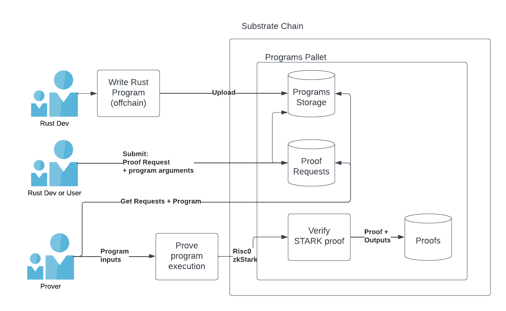

# Substrate TOEP
    T - Trustless
    O - Offchain
    E - Executable
    P - Programs

zk-provable Offchain Programs

Project which features onchain tracking of offchain Rust programs and their execution, which is proven using RISC Zero and whose zkSTARK proofs are verified onchain.

## Key Features
- zk-STARK proven execution
- Write zk-provable programs in plain Rust
- Privacy-preserving
- zk prover infrastructure, incentivised through proof market
- (Future) Composability of proofs/programs with recursive proofs 🤯



## Project Structure
```
├── node: contains all code for Substrate chain
│   ├── pallets
│   │   ├── prover-mgmt: custom pallet for proof verification, program storage, and proof market
│   ├── runtime
│   ├── node
├── examples: Contains code for example program
│   ├── factors: CLI for building and uploading "Factors" example program
│   ├── methods: Core logic for example program
├── prover: Prover application for proving one program execution and uploading its proof onchain
```

## Installation
Please follow the setup instructions located on the [Substrate docs site](https://docs.substrate.io/install/). Check the setup by running `cargo check` in the directory root.

## Developing Programs
The chain supports storing programs and verifying proofs of their execution. The examples serve as a guide for getting started. Note that the code which is executed is considered to be RISC Zero ZKVM code, which is the code whose execution is proven by the ZKVM. See the [RISC Zero docs on this topic](https://dev.risczero.com/zkvm/developer-guide/annotated-guest-code) for a full description. 

With that understanding, development of a program occurs in the same fashion as RISC Zero guest development. The above documentation can also guide on a process for local development for such programs.

### Examples
Examples demonstrating how to write an offchain program are included in `./examples`. The current example also uploads the program to the chain, and requests a proof for it.

## Usage instructions
This walks through an example workflow which consists of:
1. A program developer writes their program and uploads it to the chain
2. The program developer also submits a request for a proof to be generated for their program
3. A prover notes the request, starts the proving process, generates the proof, and submits it to the chain, fulfilling the request.

### Start the chain
Start the chain by building the code `cargo build --release`, and starting the node: `./target/release/node-template --dev`(for docker: follow the steps in `Docker Instructions`)

### Upload program
See `./examples` for an example of a provable program. To test uploading the program to the chain, run:
```cargo run```
from `./examples/prover`
It will return the `image id`, which is handy for proving later

### Prover
Prover nodes can fulfill onchain requests for proofs, or just prove any onchain program. The included proving cli application in `./prover` allows someone to pass an `image_id` of an onchain program, retrieve it, prove it, and upload the resulting proof to fulfill the request. To test, pass a hex-encoded, bincode-serialized image id(just copy the output from the `./examples` local execution)
```
SIGNING_KEY={your signing key} cargo run -- --image-id {your image id}
```

### Docker Instructions
1. `docker pull vivekvpandya/toep`
2. `docker run -dit --net=host vivekvpandya/toep --dev`
3. connect polkadot.js app on 127.0.0.1:9944

